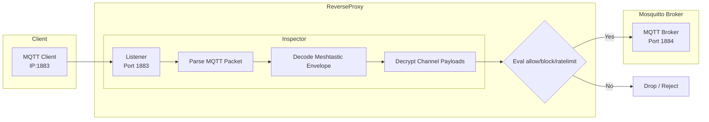

# MQTT + Meshtastic packet inspector
I want to deploy `mosquitto` (a standard MQTT broker) to support Meshtastic clients, but I also want to have security rules to support rate limiting, blocking and packet rewriting based on IP addresses, MQTT users, and the Meshtastic payload properties.

`./meshtk server proxy --debug=trace`

>mosquitto doesn't support "proxy protocol" which means it doesn't know the actual requesters IP address in many situations. Example, an AWS Network Load Balancer forwarding traffic to an ECS/EC2 cluster running `mosquitto` would think all traffic is from the NLB's IP addresses. Proxy Protocol is designed for this exact situation and implemented in many tools (nginx, HAproxy, etc.)

>mosquitto doesn't "speak Meshtastic" because it's an MQTT broker that simply brokers payloads. Meshtastic has a concept of channels, which map to topics, which are able to use differnt channel keys for encryption. mosquitto cannot see into these payloads.

Each MQTT CONNECT/PUBLISH request arriving at :1883 will 1) use proxy protocol to get the correct IP address for the request, 2) evaluate and decrypt Meshtastic payload with the correct channel key and 3) provide an opportunity for rate limiting/blocking/rewriting.

Start a listener defined in the config by default:

`./meshtk server proxy --debug=trace`

```yaml
Server:
  ProxyListenAddress: "0.0.0.0:1883"
  ProxyForwardAddress: "0.0.0.0:1884"
```
This starts the reverse proxy listening on :1883 and forwarding to :1884.



# MQTT protocol versions (dual codec)

The proxy speaks **MQTT 3.1.1 and MQTT 5.0**, chosen per connection. The first
packet's protocol level is peeked without consuming it, and the whole connection
— both directions — then uses the matching codec. Meshtastic firmware and iOS
speak 3.1.1; Meshtastic-Android 2.8 (`mqttastic`) speaks 5.0 and does **not**
fall back, so both codecs have to work.

| Protocol level | Behaviour |
|---|---|
| 4 (MQTT 3.1.1) | Original path, unchanged |
| 5 (MQTT 5.0) | v5 codec: CONNECT auth + credential swap, PUBLISH inspection, rules, rewrites, downlink logging and self-echo suppression — all the same rules as 3.1.1 |
| > 5 | Refused before the broker is dialled |

Only CONNECT, CONNACK and PUBLISH are ever parsed on a v5 connection. Every
other packet — SUBSCRIBE, PUBACK, PINGREQ, DISCONNECT, AUTH, anything carrying
a property the codec does not model — is relayed as the exact bytes that came
in. A packet the codec cannot parse is therefore a non-event rather than a
dropped connection.

## Log actions to grep

All v5 lines follow the existing `action=..., ip=..., username=...` grammar.

| Line | Meaning | What to do |
|---|---|---|
| `action=MQTT5_CONNECT` | A v5 client authenticated successfully. Logged with the client's ORIGINAL username, so this is the Android-adoption counter. | Nothing — this is the healthy case |
| `action=MQTT5_REJECT` | Protocol level above 5. Answered `0x84` before the broker is dialled. | Some client is speaking a version that does not exist yet; check what it is |
| `action=MQTT5_AUTH_METHOD` | The CONNECT asked for enhanced auth (`Authentication Method` property). Answered `0x8C`. | Kept separate from `AUTH_REJECT` on purpose: if this appears at volume, mqttastic started using enhanced auth and every Android client is being refused |
| `action=MQTT5_PARSE_FAIL` | A packet could not be decoded. On CONNECT this fails closed (no broker dial); on PUBLISH the raw frame is relayed and the session survives. | At volume, a client is sending a property the codec does not model — investigate before it becomes a blind spot |
| `action=AUTH_REJECT` | Bad or missing credentials. Answered `0x87`. | Same meaning as on the 3.1.1 path |
| `action=BLOCK, reason=topic_alias_uplink` | A v5 client published with a topic alias or an empty topic. | Spec-violating client — aliases are suppressed at CONNECT, so it should be impossible |

## CONNACK reason codes

The version-correct code matters: 3.1.1's return code `0x05` is meaningless in
v5 and surfaces in the Meshtastic app as a bogus "check credentials" error.

| Code | Meaning | When |
|---|---|---|
| `0x87` Not Authorized | Bad credentials, empty username, or an authenticator error | Wire bytes `2003008700` |
| `0x8C` Bad Authentication Method | CONNECT carried an `Authentication Method` property | Wire bytes `2003008c00` |
| `0x84` Unsupported Protocol Version | Protocol level **above 5** only — never for a v5 client | Wire bytes `2003008400` |

## Topic aliases are suppressed in both directions

mosquitto advertises `Topic Alias Maximum = 10` by default. That would let a v5
client publish with an **empty topic** plus a Topic Alias, which blinds every
topic-based rule and every `msh/...` log line while the broker resolves the
alias and fans the packet out perfectly normally.

The proxy strips `TopicAliasMaximum` from the client's CONNECT (so the broker
never aliases downlink) and from the broker's CONNACK (so the client never
aliases uplink), and blocks any uplink PUBLISH that arrives aliased anyway. No
broker configuration change is involved, so a `mosquitto.conf` drift cannot
undo it.

## Testing against a real broker

`internal/app/server/proxy_v5_e2e_test.go` runs a live mosquitto behind a live
proxy listener with a v5 client and a 3.1.1 client in the same run. It is gated
so a plain `go test ./...` stays hermetic:

```bash
MESHTK_E2E=1 go test ./internal/app/server/ -run TestE2EDualCodec -v
MESHTK_E2E=1 MESHTK_E2E_DOCKER=1 go test ./internal/app/server/ -run TestE2EDualCodec
```

The broker is resolved as Homebrew mosquitto, then `mosquitto` on `PATH`, then a
docker `alpine:3.21` container (the production image base). Credentials are
generated at run time into a temp dir; nothing credential-shaped is committed.

# Rules and Rewrites

Rules block/accept packets and can also rewrite MQTT or the Meshtastic details.

Full details in the [Rules.go](https://github.com/whereiskurt/meshtk/blob/main/internal/app/protoserver/rules.go) file itself, but here are some highlights.

Here's a `BLOCK` example that only allows traffic you can decrypt (naively blocks PKI too):
```golang
{
  Name:        "BlockInvalidEncryption",
  Description: "Block packets that failed to decrypt with any known key",
  Matcher: func(packet *InspectorPacket) bool {
    return packet.Meshtastic.WasEncrypted && !packet.Meshtastic.WasUnmarshalled
  },
  Action: Block,
  Reason: "Failed to decrypt with any known key",
},
```

Here's a `KEEP` rule an example that allows only certains types of Meshtastic apps:
```golang
{
  Name:        "AllowedMeshtasticApps",
  Description: "Always allow NodeInfo packets",
  Matcher: func(packet *InspectorPacket) bool {
    return packet.Meshtastic.PortNum == meshtastic.PortNum_NODEINFO_APP ||
      packet.Meshtastic.PortNum == meshtastic.PortNum_POSITION_APP ||
      packet.Meshtastic.PortNum == meshtastic.PortNum_TEXT_MESSAGE_APP
  },
  Action: Keep,
  Reason: "NodeInfo/Position/Text Message packets are always allowed",
},
```

Here are some rewrites:
```golang
func(ip *InspectorPacket) bool {
  // Check if the packet is a Meshtastic packet
  if ip.Raw.Meshtastic == nil ||
    ip.Raw.Meshtastic.Packet == nil ||
    ip.Raw.Meshtastic.Packet.HopLimit <= 3 {
    return false
  }
  ip.Raw.Meshtastic.Packet.HopLimit = 3
  return true
},
```
Here's a Meshtastic example:
```golang
func(ip *InspectorPacket) bool {
  // Check if the packet is a Meshtastic packet that's not PKI
  if ip.Raw.Meshtastic == nil ||
    ip.Raw.Meshtastic.Packet == nil ||
    ip.Meshtastic.Decoded == nil ||
    ip.Meshtastic.Decoded.Portnum != meshtastic.PortNum_TEXT_MESSAGE_APP ||
    ip.Meshtastic.WasPKIEncrypted {
    return false
  }

  if ip.Track.Username == "public" {
    ip.Meshtastic.PayloadString = strings.ReplaceAll(ip.Meshtastic.PayloadString, "hello", "👋")
    ip.Meshtastic.PayloadString = strings.ReplaceAll(ip.Meshtastic.PayloadString, "fuck", "🤬")
    n.RewriteFromPayloadString(ip)
  }

  return true
}
```

# Why this approach?
I think this is the happy middle ground between writing a plugin just for mosquitto/emqx/hivemq/etc. and instead having a single fronted solution. If I want to leverage `mosquitto` as broker, and have a security context for each request, this is the only way. While other tools may support proxy protocol out of the box, they won't be able to read `Meshtastic` payloads. 

## `mosquitto` limits
Here are some limits driving this implementation:

1. mosquitto doesn't support "proxy protocol" which means it doesn't know the actual requesters IP address in many situations. Example, an AWS Network Load Balancer forwarding traffic to an ECS/EC2 cluster running `mosquitto` would think all traffic is from the NLB's IP addresses. Proxy Protocol is designed for this exact situation and implemented in many tools (nginx, HAproxy, etc.)

1. mosquitto doesn't "speak Meshtastic" because it's an MQTT broker that simply brokers payloads. Meshtastic has a concept of channels, which map to topics, which are able to use differnt channel keys for encryption. mosquitto cannot see into these payloads.

1. moquitto plugin architecture expects native C and makes it best suited for protobufs and remote procedure calls. While robust flowing in-out-in of mosquitto isn't cache friendly and feels 'out-of-order.'

# TODO
* Consider adding backend connection pool to preconnect 100-1000x connects.

