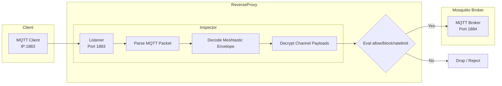

# MQTT + Meshtastic packet inspector
I want to deploy `mosquitto` (a standard MQTT broker) to support Meshtastic clients, but I also want to have security rules to support rate limiting, blocking and packet rewriting based on IP addresses, MQTT users, and the Meshtastic payload properties.

`./meshtk server proxy --debug=trace`

>mosquitto doesn't support "proxy protocol" which means it doesn't know the actual requesters IP address in many situations. Example, an AWS Network Load Balancer forwarding traffic to an ECS/EC2 cluster running `mosquitto` would think all traffic is from the NLB's IP addresses. Proxy Protocol is designed for this exact situation and implemented in many tools (nginx, HAproxy, etc.)

>mosquitto doesn't "speak Meshtastic" because it's an MQTT broker that simply brokers payloads. Meshtastic has a concept of channels, which map to topics, which are able to use differnt channel keys for encryption. mosquitto cannot see into these payloads.

Each MQTT CONNECT/PUBLISH request arriving at :1883 will 1) use proxy protocol to get the correct IP address for the request, 2) evaluate and decrypt Meshtastic payload with the correct channel key and 3) provide an opportunity for rate limiting/blocking/rewriting.

Start a listener defined in the config by default:

`./meshtk server proxy --debug=trace`

```yaml
Server:
  ProxyListenAddress: "0.0.0.0:1883"
  ProxyForwardAddress: "0.0.0.0:1884"
```
This starts the reverse proxy listening on :1883 and forwarding to :1884.



# Rules and Rewrites

Rules block/accept packets and can also rewrite MQTT or the Meshtastic details.

Full details in the [Rules.go](https://github.com/whereiskurt/meshtk/blob/main/internal/app/protoserver/rules.go) file itself, but here are some highlights.

Here's a `BLOCK` example that only allows traffic you can decrypt (naively blocks PKI too):
```golang
{
  Name:        "BlockInvalidEncryption",
  Description: "Block packets that failed to decrypt with any known key",
  Matcher: func(packet *InspectorPacket) bool {
    return packet.Meshtastic.WasEncrypted && !packet.Meshtastic.WasUnmarshalled
  },
  Action: Block,
  Reason: "Failed to decrypt with any known key",
},
```

Here's a `KEEP` rule an example that allows only certains types of Meshtastic apps:
```golang
{
  Name:        "AllowedMeshtasticApps",
  Description: "Always allow NodeInfo packets",
  Matcher: func(packet *InspectorPacket) bool {
    return packet.Meshtastic.PortNum == meshtastic.PortNum_NODEINFO_APP ||
      packet.Meshtastic.PortNum == meshtastic.PortNum_POSITION_APP ||
      packet.Meshtastic.PortNum == meshtastic.PortNum_TEXT_MESSAGE_APP
  },
  Action: Keep,
  Reason: "NodeInfo/Position/Text Message packets are always allowed",
},
```

Here are some rewrites:
```golang
func(ip *InspectorPacket) bool {
  // Check if the packet is a Meshtastic packet
  if ip.Raw.Meshtastic == nil ||
    ip.Raw.Meshtastic.Packet == nil ||
    ip.Raw.Meshtastic.Packet.HopLimit <= 3 {
    return false
  }
  ip.Raw.Meshtastic.Packet.HopLimit = 3
  return true
},
```
Here's a Meshtastic example:
```golang
func(ip *InspectorPacket) bool {
  // Check if the packet is a Meshtastic packet that's not PKI
  if ip.Raw.Meshtastic == nil ||
    ip.Raw.Meshtastic.Packet == nil ||
    ip.Meshtastic.Decoded == nil ||
    ip.Meshtastic.Decoded.Portnum != meshtastic.PortNum_TEXT_MESSAGE_APP ||
    ip.Meshtastic.WasPKIEncrypted {
    return false
  }

  if ip.Track.Username == "public" {
    ip.Meshtastic.PayloadString = strings.ReplaceAll(ip.Meshtastic.PayloadString, "hello", "👋")
    ip.Meshtastic.PayloadString = strings.ReplaceAll(ip.Meshtastic.PayloadString, "fuck", "🤬")
    n.RewriteFromPayloadString(ip)
  }

  return true
}
```

# Why this approach?
I think this is the happy middle ground between writing a plugin just for mosquitto/emqx/hivemq/etc. and instead having a single fronted solution. If I want to leverage `mosquitto` as broker, and have a security context for each request, this is the only way. While other tools may support proxy protocol out of the box, they won't be able to read `Meshtastic` payloads. 

## `mosquitto` limits
Here are some limits driving this implementation:

1. mosquitto doesn't support "proxy protocol" which means it doesn't know the actual requesters IP address in many situations. Example, an AWS Network Load Balancer forwarding traffic to an ECS/EC2 cluster running `mosquitto` would think all traffic is from the NLB's IP addresses. Proxy Protocol is designed for this exact situation and implemented in many tools (nginx, HAproxy, etc.)

1. mosquitto doesn't "speak Meshtastic" because it's an MQTT broker that simply brokers payloads. Meshtastic has a concept of channels, which map to topics, which are able to use differnt channel keys for encryption. mosquitto cannot see into these payloads.

1. moquitto plugin architecture expects native C and makes it best suited for protobufs and remote procedure calls. While robust flowing in-out-in of mosquitto isn't cache friendly and feels 'out-of-order.'

# TODO
* Consider adding backend connection pool to preconnect 100-1000x connects.

